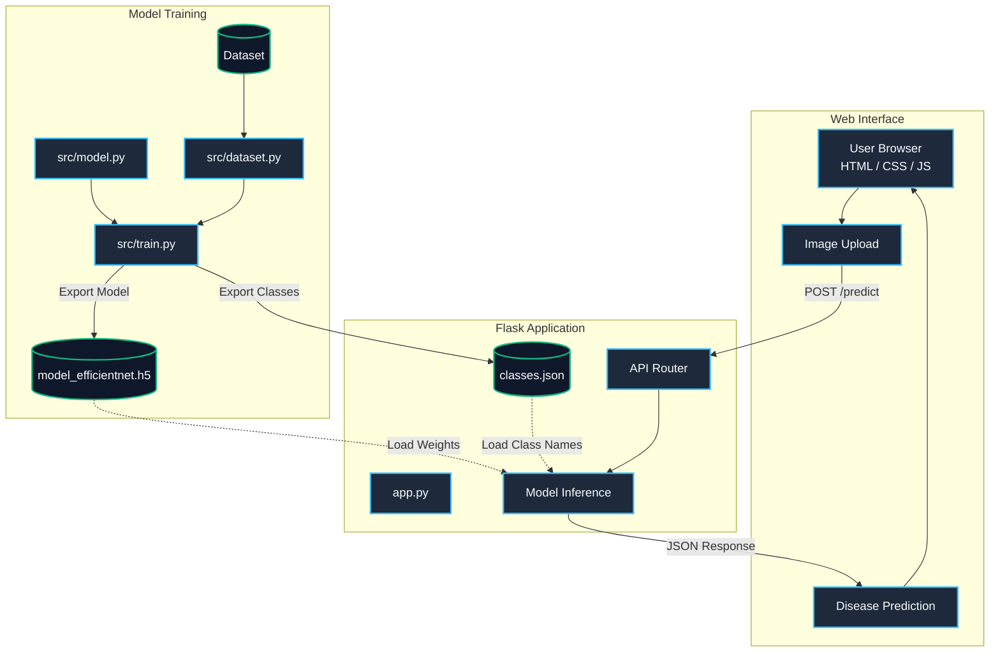

# 🍃 PhytoVision: Plant Disease Classifier

PhytoVision is an advanced deep learning-based image classification web application designed to instantly identify diseases in plant leaves (specifically Tomato, Potato, and Bell Pepper). 

Powered by a fine-tuned **EfficientNetV2** model and a modern Flask web interface, this tool helps farmers and agricultural researchers rapidly diagnose crop health issues.

## ✨ Features
- **High Accuracy AI:** Utilizes Transfer Learning on modern CNN architectures (EfficientNetV2, ResNet50, InceptionV3) for robust feature extraction.
- **Dynamic Inference Engine:** The Flask backend automatically adapts to new plant diseases by dynamically loading predictions from a JSON configuration generated during training.
- **Premium UI:** A sleek, dark-mode, glassmorphic web interface built with Vanilla JS and responsive CSS.
- **Fast Training Pipeline:** Employs modern `tf.data.Dataset` pipelines with prefetching and caching for maximum GPU utilization during training.

---

## 🏗️ System Architecture



---

## 🚀 Getting Started

### Prerequisites
- Python 3.8+
- TensorFlow 2.x
- Flask

### 1. Clone the repository
```bash
git clone https://github.com/SihanUdayaratna03/Deep-leaf-flask.git
cd Deep-leaf-flask
```

### 2. Install dependencies
```bash
pip install -r requirements.txt
```

### 3. Training the Model (Optional)
If you have a custom dataset, place your training and testing images in `Datasets/train` and `Datasets/test`. Then run the training pipeline:
```bash
python src/train.py
```
*This will automatically generate a new `model_efficientnet.h5` and `classes.json`.*

### 4. Run the Web App
Start the Flask development server:
```bash
python app.py
```
Navigate to `http://127.0.0.1:5001` in your browser!


